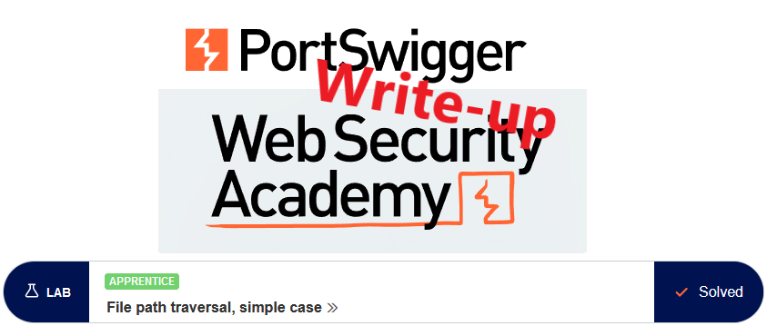
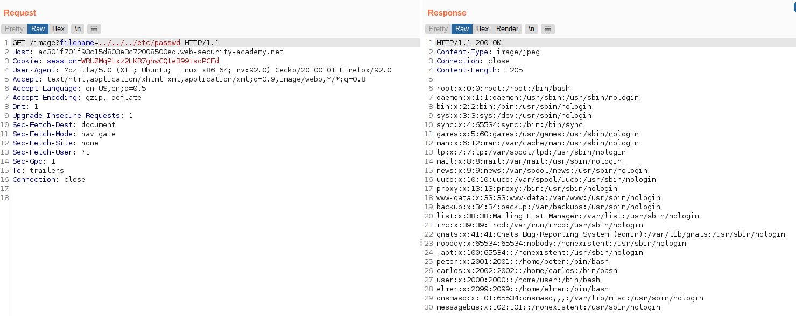

# Write-up: File path traversal, simple case @ PortSwigger Academy

This write-up for the lab *File path traversal, simple case* is part of my walkthrough series for [PortSwigger's Web Security Academy](https://portswigger.net/web-security).

**Learning path**: Server-side topics → Directory traversal

Lab-Link: <https://portswigger.net/web-security/file-path-traversal/lab-simple>  
Difficulty: APPRENTICE  
Python script: [script.py](script.py)  

## Lab description

## Steps

### Analysis

As usual, the first step is to check how the website works. It is a shop website with a few rather interesting products. I recommend reading the product descriptions. It does not help at all with the lab, but PortSwigger put in the effort to write interesting texts so the least we can do is read them.

When checking the source of the page, interesting things show up. The product images are given as explicit file names in URL arguments to `/image`:

Calling this URL directly in the browser (e.g. `https://ac301f701f93c15d803e3c72008500ed.web-security-academy.net/image?filename=10.jpg`) will display just the image.

### Injecting more interesting file names

To make it easier, I send the request to Burp Repeater. If you don't see it in the `HTTP history`, check if images are filtered out in the filter bar (by default it is hidden):

Start by using `/etc/passwd` as filename and adding some `../` to the beginning. With `../../etc/passwd` it gives a `"No such file"` error, but once I go three levels up, this changes:

And at the same time, the lab changed to

