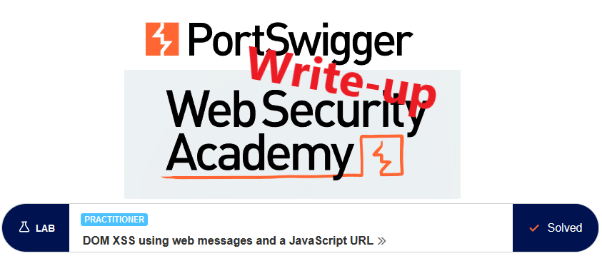
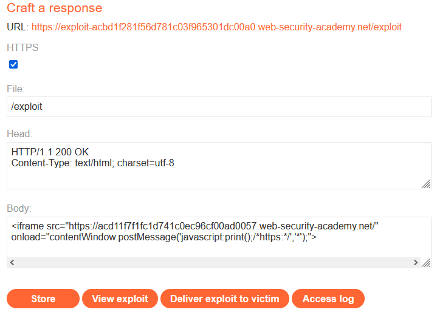

# Write-up: DOM XSS using web messages and a JavaScript URL @ PortSwigger Academy



This write-up for the lab *DOM XSS using web messages and a JavaScript URL* is part of my walk-through series for [PortSwigger's Web Security Academy](https://portswigger.net/web-security).

Learning path: Client-side → DOM-based vulnerabilities

Lab-Link: <https://portswigger.net/web-security/dom-based/controlling-the-web-message-source/lab-dom-xss-using-web-messages-and-a-javascript-url>  
Difficulty: PRACTITIONER  
Python script: [script.py](script.py)  

## Lab description

 

## Steps

### Analyze

As usual, the first step is to analyze the functionality of the lab application, in this case, a blog website.

From plain browsing of the site, nothing is immediately obvious. So I turn to the source of the page and find an interesting script:


When a message is received by the window, a check is performed whether it contains an `http:` or `https:`. If found to be so, the current location will redirect to the data value of the message.

### The theory

If I can load the page in an iframe within a page I control, I can send arbitrary data to the application. A google search brings me to the [mozilla documentation for iframe](https://developer.mozilla.org/en-US/docs/Web/HTML/Element/iframe#scripting). 
Interesting for the lab is the scripting information:


So I can access the window object of the lab application to send the message. The Mozilla documentation also shows the correct syntax for [sending a message](https://developer.mozilla.org/en-US/docs/Web/API/Window/postMessage) to the window object of the `iframe`:

```
postMessage(message, targetOrigin)
postMessage(message, targetOrigin, transfer)
```

My payload will be transported in the `message`, while the `targetOrigin` is the target domain or a `*` as a synonym for *the full world*. 

I need a payload that contains an `http:` or `https:`, it does not require it at the beginning of the string. No other validation is done on the content. As long as I ensure one of these strings is anywhere in my code, for example in a JavaScript comment, it will pass the validation.

In most browsers, using `javascript:alert("Hello World");` as URL will execute the code. As the code in the lab application puts whatever string I send straight into the URL.

## The malicious page

Now that I have all pieces together, I can craft my malicious page. The iframe needs to load the lab application and send a message after it loads:

```html
<iframe src="URL" onload="contentWindow.postMessage('PAYLOAD','*');">
```

The `URL` will be the lab URL. As payload, I need a combination of my actual payload `javascript:print();` as well as a comment `/*https:*/` to pass the validation.



I store the code and view the exploit. As expected, the print dialog opens. 

After I deliver the exploit to the victim, the lab updates to


